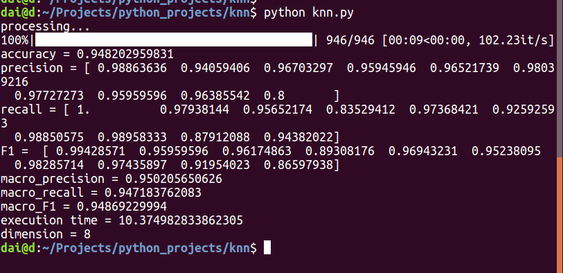
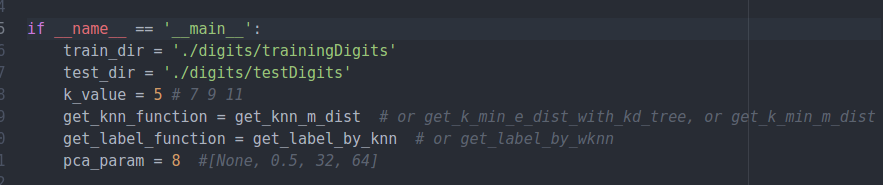
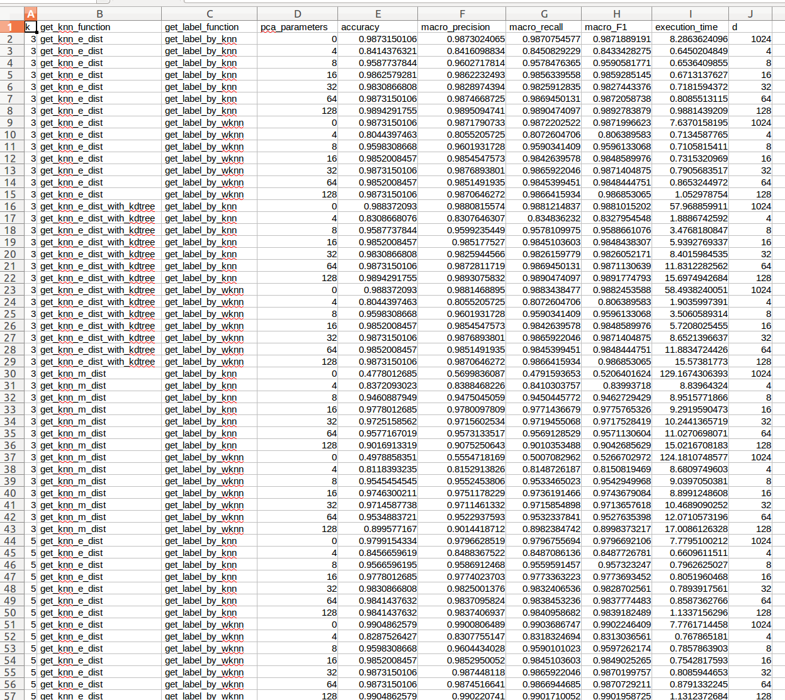

# KNN实验
#### 代东洋, 2017210885, ddy17@mails.tsinghua.edu.cn
## 简介
本次实验使用K-近邻算法对手写数字进行分类。

涉及的算法包括：

+ 寻找k近邻：
	+ 使用欧式距离寻找k近邻
	+ 使用马氏距离寻找k近邻
	+ 在欧式距离的情况下，使用KD树改进节点检索，寻找k近邻
+ 根据k近邻确定测试样本的类别：
	+ 基本的KNN算法
	+ 改进权值的wknn算法
+ 使用pca算法进行降维

代码使用Python3语言，代码依赖numpy、tqdm库。其中tqdm提供进度条的功能，便于观察实验的进度。

数据在digits文件夹下。

## 算法原理
#### 寻找k近邻
顾名思义，寻找k近邻就是寻找距离测试样本最近的k个最近的训练样本（以后会根据这k个训练样本确定该测试样本的类别）。本实验中涉及到的实验的度量方法有两种：欧氏距离和马氏距离。
##### 欧氏距离
样本 $x=(x_1, x_2, ...x_d)^T$ 和样本 $y = (y_1, y_2, ... y_d)^T$ 之间的欧氏距离为：
$$d = \sqrt{(x-y)^T(x-y)}$$
##### 马氏距离
样本 $x=(x_1, x_2, ...x_d)^T$ 和样本 $y = (y_1, y_2, ... y_d)^T$ 之间的马氏距离为：
$$d = \sqrt{(x-y)^T\Sigma^{-1}(x-y)}$$
其中$\Sigma$为样本协方差矩阵，根据ppt内容，应该是训练集和测试样本组成的集合的协方差矩阵，但由于训练集有1000多个样本，单个测试样本对协方差矩阵的影响很小，所以只算了训练集的协方差矩阵。这样的一个好处是，可以预先把协方差矩阵以及它的逆算好，不必每测试时都算一遍协方差矩阵，节省了程序的运行时间。

##### 欧式距离+KD树
kd树（ k-维树的缩写，）是在k维欧几里德空间组织点的数据结构。kd树的k和knn的k不一样，下面出现的k如无特别说明一般指的是knn的k。关于kd树的详细介绍参见李航的《统计学习基础》第41~44页，不再累述，这里主要介绍一下自己实现时的一些做法。

本实验中选择轮流的方法选择垂直分区面（有些地方先选择方差大的做垂直分区面，不过本实验中我实现的比较简单，就是依次按照1、2...d维特征作为分区考虑的特征）。

kd树每一个子树对应于一个超矩形区域。如果测试样本到超矩形区域的最小距离都比搜索过程中当前k近邻中最大的距离要大，那没必要对该超矩形区域进行搜索。因此，为了方便计算测试样本到每个子树的超区域的最小距离，kd树的每个节点用两个向量分别表示了该超区域每个维度下的最小值和最大值。

李航那本书上提供的利用kd树求最近邻的算法，而本实验中需要求k近邻。因此，本实验中用到了一个固定容量为k的最大堆，用来存储搜索过程中k个距离最小的训练样本。最大堆有个函数`get_max_dist_sq()` 返回当前最大堆的最大值，如果最大堆达到容量k时，该函数返回`float('inf')`,然后最大堆使用`update_value()`函数更新最大堆，该函数会把新加入的数据替换掉最大堆中的最大数据。这样，在kd树中进行搜索时，只要判断当前比较的训练样本的距离（的平方）是否小于`get_max_dist_sq()`即可。如果小于`get_max_dist_sq()`，则使用`update_value()`函数把当前训练样本放入最小堆即可。当程序从叶节点搜索到根节点结束后，最大堆中的k个值即为k个近邻。

本实验中，构造kd树采用递归的方法。

从kd树中搜索k近邻需要前面讲过的最大堆。搜索方法如下：先找到包含测试样本的叶节点。然后从该叶节点开始，递归地向上搜索，比较它的父节点以及在它的兄弟子树中进行搜索，直到根节点搜索结束（`KDTree.py`中的`search_bottom_up()`函数）。其中在它的兄弟子树中搜索时，又需要递归地向下搜索（`KDTree.py`中的`search_sub_tree()`函数）。

##### 马氏距离+KD树
马氏距离+KD树的情况没能实现，可以作为以后进一步改进的一个方向。

由于kd树欧几里德空间组织点的数据结构，欧氏距离最小时不一定对应的马氏距离也最小，所以无法直接计算测试样本到超区域的最小距离。

但是根据欧氏距离的公式

$$d = \sqrt{(x-y)^T\Sigma^{-1}(x-y)}$$

其中$x=(x_1, x_2, ...x_d)^T$ ， $y = (y_1, y_2, ... y_d)^T$ 

不考虑$\Sigma$不可逆的情况，由于$\Sigma$是实对称矩阵，因此
$$\Sigma = Q \Lambda Q^T$$

其中$Q$是正交矩阵，$\Lambda$是对角阵，且对角线每一个元素都是$\Sigma$的特征值。$\Lambda^{-1}$即为$\Lambda$对角线每一个元素取倒数。所以：
$$\Sigma^{-1} = Q \Lambda^{-1} Q^T$$

令$B=\Lambda^{-1}$， $P=Q^T$，显然$B$是对角阵，$P$是正交阵。

$$ \Sigma^{-1} = P^T B P$$
$$ \Sigma^{-1} = (P B^{1/2})^T(B^{1/2}P)$$

令$M = B^{1/2}P$，因此
$$\Sigma^{-1} = M^TM$$
$$d = \sqrt{(x-y)^T\Sigma^{-1}(x-y)} $$
$$d = \sqrt{(x-y)^TM^TM(x-y)}$$
$$d = \sqrt{(Mx - My)^T(Mx-My)}$$

令$x^{'} = Mx$，$y^{'} = My$，则
$$d = \sqrt{(x^{'} - y^{'})^T(x^{'}-y^{'})}$$

说明马氏距离就是特征进行线性变换后的欧氏距离，其中变换矩阵为$M$。

这样，就可以把马氏距离转化为欧氏距离。（不过，使用这个方法我测试样本的正确率不到20%，还没找到bug在哪，来不及实现这个方法了。。。，对应的代码核心部分在`knn.py`的`get_ints_m_trans_matrix`函数中，已经被注释掉。。。）。

#### 确定测试样本的类别
##### knn
k个近邻中，哪个类别的训练样本最多，就用哪个类别作为测试样本的类别。当有多个类别训练样本最多（一样多），本次实验附件的论文中提供的方案是随机选择一个，不过本实验中在这种情况下怎么选择类别，取决于Python内置`max()`函数的实现。
##### wknn
knn中，每个样本的权重是1，即每个样本的重要性是一样的。wknn中，认为距离测试样本越近，其权重越大。距离第 $i$ 近邻居的权重为
$$w_i = (h_k - h_i)/(h_k - h_1)$$
 其中$h_i$表示第 $i$ 近的邻居到测试样本的距离。所以 $h_k$ 表示最远的距离，$h_1$表示最近的距离。当 $h_k=h_1$时，每个近邻的距离都相等，这时候调用基本knn的方法确定类别即可。
#### 降维
本次实验中使用pca降维。参考于周志华那本西瓜书的230~231页。

其主要过程为，先对样本集$X^{'}$（训练集）进行中心化,得到$X$，然后求其协方差矩阵$XX^T$的特征值和特征向量。将特征值进行排序：$\lambda_1 \ge \lambda2 \ge ... \ge \lambda_d$，取前$d^{'}$个特征值对应的向量$W = (w_1, w_2, ..., w_{d^{'}})$，$W$就是转换矩阵。也可以实现设定好一个阈值t，取满足下面条件的最小$d^{'}$作为降维后的维度。
$$\frac{\Sigma_{i=1}^{d^{'}}\lambda_i}{\Sigma_{i=1}^{d}\lambda_i} \le t$$

本次实验中，实现了这两种方法。`pca_trans_with_new_d()`函数指定降维后的维度，`pca_trans_with_threshold()`指定阈值`t`进行降维。
## 重要代码
这里介绍一些关键的函数以及重要代码。
共有5个Python文件。其中，`KDTree.py`主要是实现KD树的相关代码。程序流程的关键结构在`knn.py`中。`experiment.py`是进行实验的部分代码。`KDTree_test.py`和`knn_test.py`时作者debug时所用的代码，没什么用。

`KDTree.py`中：

+ `class Node`定义了KD树的节点
+ `construct_kd_node(samples, labels, feature, father_node)`函数用于递归地构造KD树。`samples`代表当前子树处理的样本集，`labels`代表样本集对应的类别。`feature`代表当前子树的根节点需要根据第`feature`个属性划分超区域。`father_node`代表当前子树的根节点。该函数的返回值是构造好的子树的根节点。
+ `class KnnHeap`是搜索过程中需要维护的最大堆。
	+ 最大堆更新变量的的函数如下， `diat_sq`代表距离的平方（新加入的训练样本距离测试样本距离的平方），`instance`代表新加入的训练样本（更近的邻居）， `label`代表该样本的类别。当该堆未满时，把新变量加入叶节点，自下向上调整堆；当该堆满了后，把新节点放入根节点，自上向下调整堆：
```Python
def update_value(self, dist_sq, instance, label):
        if self.cur_max_idx < self.capacity:
            self.cur_max_idx += 1
            self.knns.append((dist_sq, instance, label))
            i = self.cur_max_idx
            while i > 0 and dist_sq > self.knns[int(i / 2)][0]:
                self.knns[i] = self.knns[int(i / 2)]
                i = int(i / 2)
            self.knns[i] = (dist_sq, instance, label)
        else:
            self.knns[1] = (dist_sq, instance, label)
            i = 1
            while 2 * i + 1 <= self.cur_max_idx and (
                    self.knns[2 * i][0] > dist_sq or self.knns[2 * i + 1][0] > dist_sq):
                j = (2 * i) if (self.knns[2 * i][0] > self.knns[2 * i + 1][0]) else (2 * i + 1)
                self.knns[i] = self.knns[j]
                i = j
            if 2 * i <= self.cur_max_idx and self.knns[2 * i][0] > dist_sq:
                self.knns[i] = self.knns[2 * i]
                i = 2 * i
            self.knns[i] = (dist_sq, instance, label)
```
+ `get_related_leaf(sample, kd_tree)`函数用于找到测试样本的“当前最近叶节点”，其中`sample`代表测试样本，`kd_tree`代表子树的根节点。
+ `search_sub_tree(sample, sub_tree, knn_heap)`函数用于向子树中进行搜索k近邻，`sample`代表测试样本，`sub_tree`代表待搜索的子树，`knn_heap`是搜索过程中需要维护的最大堆。
+ `search_bottom_up(sample, node, knn_heap, from_left)`函数是作用是递归地向上搜索k近邻，`node`代表当前节点，`from_left`是一个布尔变量，代表该搜索过程是从左边递归上来的还是从右边搜索上来的。

`knn.py`中：
+ `pca_trans_with_new_d(train_samples, test_samples, new_d)`函数得到按照pca算法,指定新的进行降维，`train_samples`代表训练集,`test_samples`代表测试集。`new_d`代表降维后的维度。`pca_trans_with_threshold(train_samples, test_samples, threshold)`函数按照阈值的方法降维。
+ `get_knn_e_dist(train_samples, new_inst, k)`函数，求欧氏距离的k近邻。`train_sampels`代表训练集，`new_inst`代表单个测试样本，`k`用于指定k近邻中的k。该函数返回k个近邻样本，以及这些样本在`train_samples`中的样本。
+ `get_knn_e_dist_with_kdtree(train_samples, new_inst, k)`函数，借助kd树求欧氏距离的k近邻。
+ `get_knn_m_dist(train_samples, inst, k)`函数，求马氏距离。`inst`代表单个测试样本。其代码如下，其中`get_train_conv_pinv(train_samples)`函数会返回一个预先算好的协方差矩阵的伪逆。
```Python
def get_knn_m_dist(train_samples, inst, k):
    pinv = get_trains_conv_pinv(train_samples)
    diff_matrix = train_samples - inst
    dist_sq = np.diag(np.dot(np.dot(diff_matrix, pinv), diff_matrix.T))
    idx = np.argpartition(dist_sq, k)
    k_idx = idx[0:k]
    return k_idx, np.sqrt(dist_sq[k_idx])
```
+ `get_label_by_knn(train_ls, k_idx, k_dist)`函数利用普通的knn方法确定测试样本的类别。其中`train_ls`是测试样本的类别，`k_idx`是之前算出来的k个最近训练样本的下标，`k_dist`是k个最近距离。`k_idx`和`k_dist`都是数组。
+ `get_label_by_wknn(train_ls, k_idx, k_dist)`函数利用wknn方法确定测试样本的类别，其代码如下：
```Python
def get_label_by_wknn(train_ls, k_idx, k_dist):
    counter = defaultdict(lambda: 0)
    min_dist = np.min(k_dist)
    max_dist = np.max(k_dist)
    if max_dist == min_dist:
        return get_label_by_knn(train_ls, k_idx, k_dist)
    for idx, dist in zip(k_idx, k_dist):
        counter[train_ls[idx]] += (max_dist - dist) / (max_dist - min_dist)
    l, _ = max(counter.items(), key=lambda x: x[1])
    return l
```
+ `get_test_samples_labels(k, train_samples, train_ls, test_samples, get_knn_func, get_label_func, pca_parameter)`函数用于通过knn算法确定测试机的类别。其中`k`代表测试样本，`train_samples`代表训练集样本，`train_ls`代表训练集的类别，`test_samples`代表测试集样本。`get_knn_func`参数是一个函数，代表计算k近邻的方法，可选的赋值为`knn.get_knn_e_dist`、`knn.get_knn_edist_with_kdtree`和`knn.get_knn_m_dist`三种（这三种函数的意义前文已经讲过）。`get_label_func`参数也是一个函数，代表根据k个近邻得到测试样本的类别的方法，其可选的赋值为`knn.get_label_by_knn`和`knn.get_label_by_wknn`。`pca_parameter`为关于降维的一个参数，当0 < `pca_parameter` < 1时，`pca_parameter`作为阈值进行降维，当`pca_parameter`>=1时，`pca_parameter`作为降维后的维度进行降维。当`pca_parameter`是0或`None`时，不降维。该函数返回测试集的类别（是一个数组），以及降维后的维数。

+ `result_evaluate(g_ls, r_ls)`函数返回一些性能参数。`g_ls`代表ground truth，`r_ls`代表通过算法分类的结果。该函数返回正确率（acc)，每个类别的准确率(precision)，每个类别的召回率(recall)，每个类别的F1，宏准确率，宏召回率，宏F1。

+ 在当前目录下，执行指令`python knn.py`便可以运行程序。
	+ 运行结果如下图：
	
	
	+ 可以更改代码中的配置项，来使用不同的方法对测试样本进行分类。其中`train_dir`代表训练样本所在的目录，`test_dir`代表测试样本所在的目录。`k_value`代表k的取值。`get_knn_function`代表获取k近邻的方法，`get_label_function`代表根据k个近邻，确定测试样本类别的方法，`pca_param`代表使用pca算法降维的参数，它们的用法和意义参照`get_test_samples_labels()`的参数`get_knn_func, get_label_func, pca_paramete`。
	
	

## 实验过程及结果分析
### 实验
实验电脑系统为Ubuntu 16.04， CPU为 `8  Intel(R) Core(TM) i7-4820K CPU @ 3.70GHz`，内存为32G。Python解释器为Python3,需要安装tqdm和numpy。

`experiments.py`文件用于实验，其主要功能为：遍历 k 取 `[3, 5, 7, 9]`, `get_knn_func` 取 `[knn.get_knn_e_dist, knn.get_knn_e_dist_with_kdtree, knn.get_knn_m_dist]`, `get_label_func`取`[knn.get_label_by_knn, knn.get_label_by_wknn]`，`pca_parameter`取`[0, 4, 8, 16, 32, 64, 128]`的 $4*3*2*8=192$ 种情况，得到每一种情况的实验数据，实验数据分别以log（日志）的形式保存在`result.txt`中，以及以表格的形式保存在`result_table.csv`。

其中`get_knn_func`代表获取k个近邻的方法，分别有直接根据欧氏距离计算，借助于kd树计算，直接根据马氏距离计算三种方法，这三种方法分别对应于`knn.get_knn_e_dist`、 `knn.get_knn_e_dist_with_kdtree`、`knn.get_knn_m_dist`这三个函数。`get_label_func`代表已知k个邻居，根据这k个邻居获取测试样本类别的方法，分别有普通knn、wknn两种方法，这两种方法对应于`knn.get_label_by_knn`、 `knn.get_label_by_wknn`这两个函数。`pca_parameter`代表降维后的维度，其中`pca_parameter = 0`代表不降维。

`experiments.py`在实验环境中运行一遍约2800秒。备份一份`result.txt`和`result_table.csv`为`result0.txt`和`result_table0.csv`随代码一起上传。

`result_table.csv`的截图如下：



### 结果

下面展示一些对比实验：
##### 未降维的情况（取k=5)：


|    方法    | 时间(s) | 正确率 | macro-F1|
| ---------- | --- |---------|--------|
| 欧氏距离（直接计算），knn| 8.118 |0.9799| 0.9796|
| 欧氏距离（直接计算），wknn| 8.203|0.9904 |0.9902 |
| 欧式距离+KD树，knn  |  58.264| 0.9809| 0.9806|
| 欧式距离+KD树，wknn  | 59.056| 0.9904| 0.9902|
| 马氏距离，knn | 119.296|0.4778| 0.5390|
| 马氏距离，wknn |126.533|0.5137| 0.5478|

通过上表可以看出:
1. wknn算法相对于knn算法能带来分类性能的提升（从正确率和macro-F1)的角度看都是这样。
2. 相对于改变获取k近邻的方法，wknn算法相对于knn算法的时间损耗完全可以接受。
3. 欧式距离直接计算和欧式距离+KD树正确率略有不同可能是因为，当有距离相等的情况时，这两种方法对样本的取舍策略不同。

##### 维度的影响（取k=5, knn算法)
+ 欧式距离

|    维度    | 时间(s) | 正确率 | macro-F1|
| ---------- | --- |---------|--------|
| 4| 0.6375 |0.8456| 0.8487|
| 8| 0.6401 |0.9566| 0.9573|
| 16|0.6708|0.9778| 0.9773|
| 32| 0.7109 |0.9830| 0.9828|
| 64| 0.7983|0.9841| 0.9837|
| 128| 0.9807|0.9841|0.9839|
|256|1.7927|0.9830|0.9828|
| 1024(未降维）| 7.8889|0.9799| 0.9796|

+ 欧氏距离+KD树

|    维度    | 时间(s) | 正确率 | macro-F1|
| ---------- | --- |---------|--------|
| 4| 2.2043 |0.8400| 0.8399|
| 8| 3.9547 |0.9560| 0.9549|
| 16| 6.5595|0.9774| 0.9773|
| 32| 9.4777 |0.9825| 0.9828|
| 64| 12.4734|0.9827| 0.9827|
| 128| 16.3887|0.9805| 0.9807|
|256|22.3874|0.9828|0.9827|
| 1024(未降维）| 57.1970|0.9809| 0.9806|

+ 马氏距离

|    维度    | 时间(s) | 正确率 | macro-F1|
| ---------- | --- |---------|--------|
| 4| 8.3398 |0.8372| 0.8405|
| 8|8.4004 |0.9482| 0.9486|
| 16|8.4698 |0.9788| 0.9787|
| 32|9.2872|0.9725| 0.9722|
| 64| 10.2437|0.9619| 0.9611|
| 128|13.8472 |0.9069| 0.9099|
| 256|23.7700|0.7389| 0.7956|
| 1024(未降维）|124.1755 |0.4778| 0.5390|

通过上面的实验结果可以发现:
1. 适当降低维度有利于分类性能的提升（尤其是对于马氏距离的情况，性能提升尤其明显）
2. 欧式距离+FD树的方案其运行时间一直小于直接使用欧氏距离的方案，可能是因为numpy的优化做得太好了吧。

##### k的取值的影响（降到16维)

+ 直接计算欧式距离，knn

|    k    | 时间(s) | 正确率 | macro-F1|
| ---------- | --- |---------|--------|
| 3| 0.6764 |0.9862| 0.9859|
| 5| 0.6812 |0.9778| 0.9773|
| 7| 0.6762 |0.9767| 0.9765|
| 9| 0.6779 |0.9767| 0.9765|
| 11|0.6794 |0.9746| 0.9746|
| 13|0.6729 |0.9704| 0.9703|

+ 直接计算欧式距离，wknn

|    k    | 时间(s) | 正确率 | macro-F1|
| ---------- | --- |---------|--------|
| 3| 0.6926 |0.9852| 0.9848|
| 5| 0.6897 |0.9852| 0.9849|
| 7| 0.6882 |0.9852| 0.9849|
| 9| 0.6932 |0.9841| 0.9837|
| 11|0.7195 |0.9841| 0.9838|
| 13|0.6945 |0.9830| 0.9828|

通过的上面的实验可以看出，当 $k \in \{3, 5, 7, 9, 11, 13\}$ 时。k的变化对运行时间的影响不大。随着k的增大，分类的性能越来越差，这一点对于knn算法来说尤其明显（wknn还没那么明显）。


